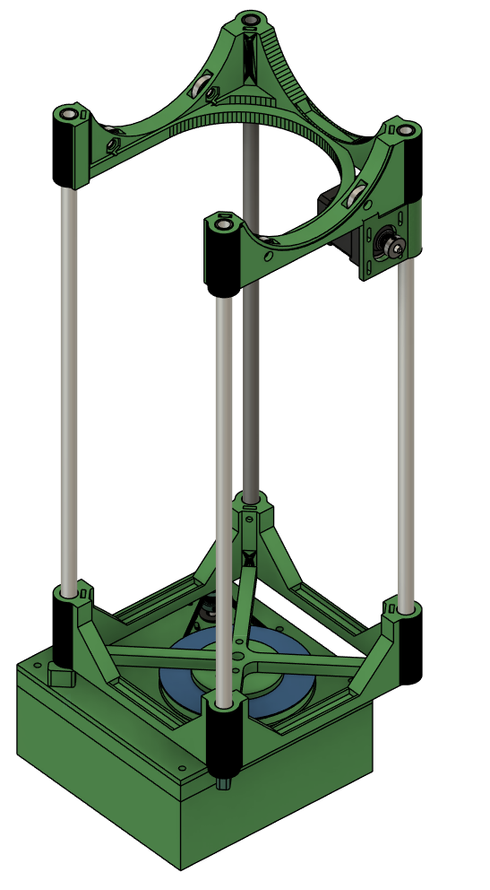
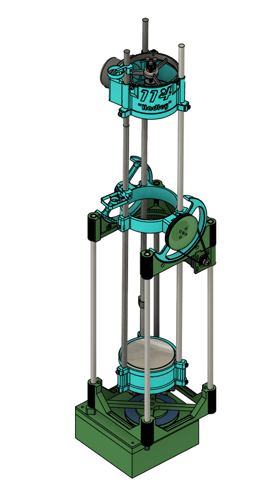
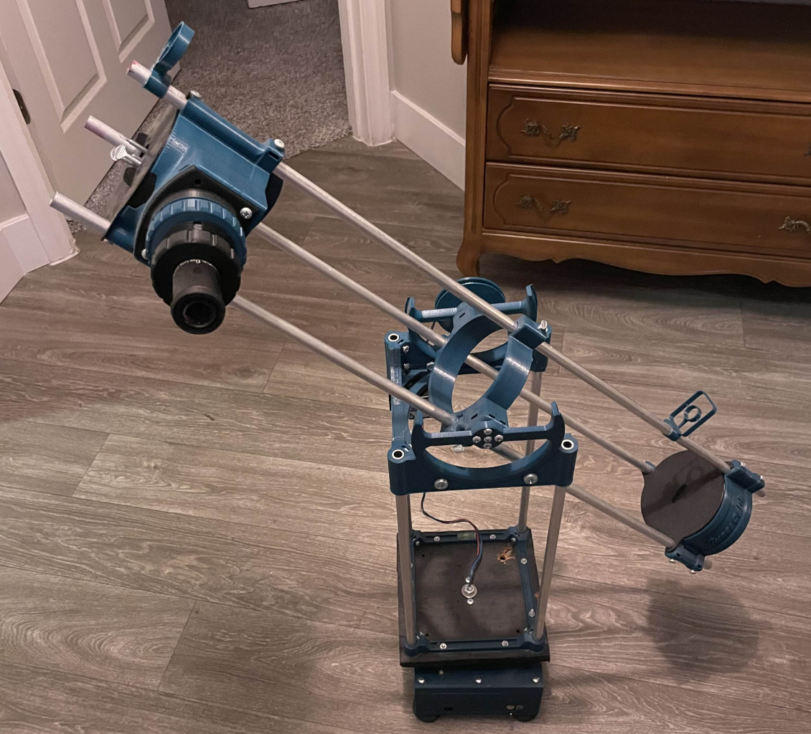
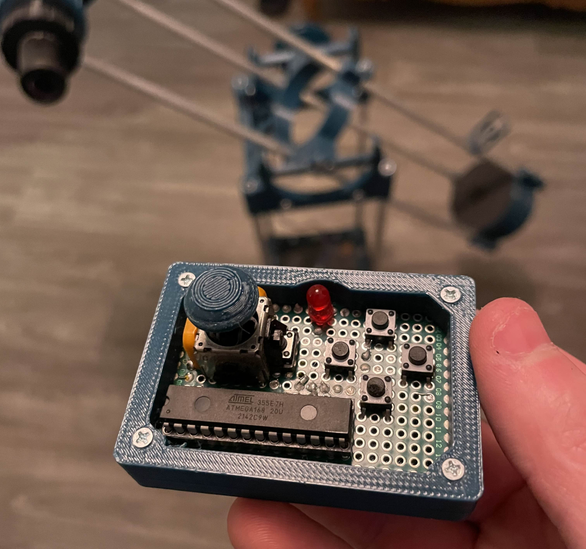

# Hadley Electric Stand

The Hadley is a maker-friendly 114mm telescope capable of being buld with a 3D printer and some hardware. It can see objects as distant as the rings on saturn. The problem is when viewing objects that far away, they move out of focus unless you can track them.

This project creates the simplest version of a stand for the hadley telescope that can be easily pointed and follow objects through the night sky. My goal when building the stand was to build a framework to implement object tracking in the future. After building the MVP of this stand, I was able to get the pictures I wanted and had no need to expand it with full star-tracking software.

It uses an Alt-Azimuth movement system, with 1 Nema 17 controlling the Azimuth, and 1 Nema 17 controlling the Altitude. The electronics include an ATMEGA328P as a remote control using an I2C expander through an AUX cable, and an Arduino Mega to drive the stepper motors. The electronics are powered by a 12V lead acid battery.

### Rendered Base

### Total Rendered Assembly

### Complete Telescope

### Remote control

